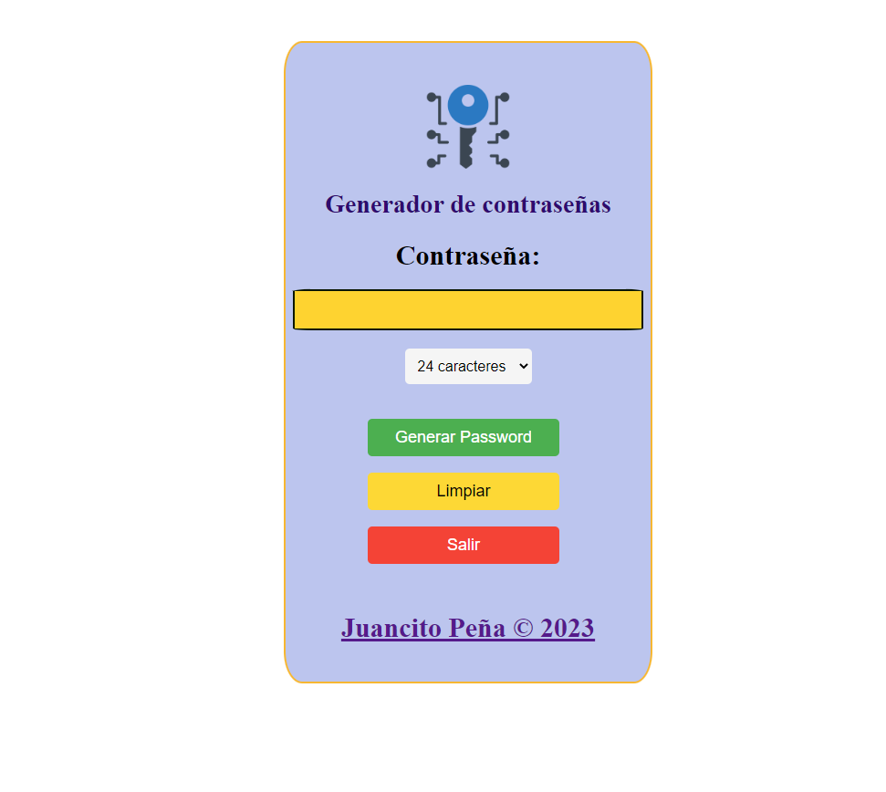
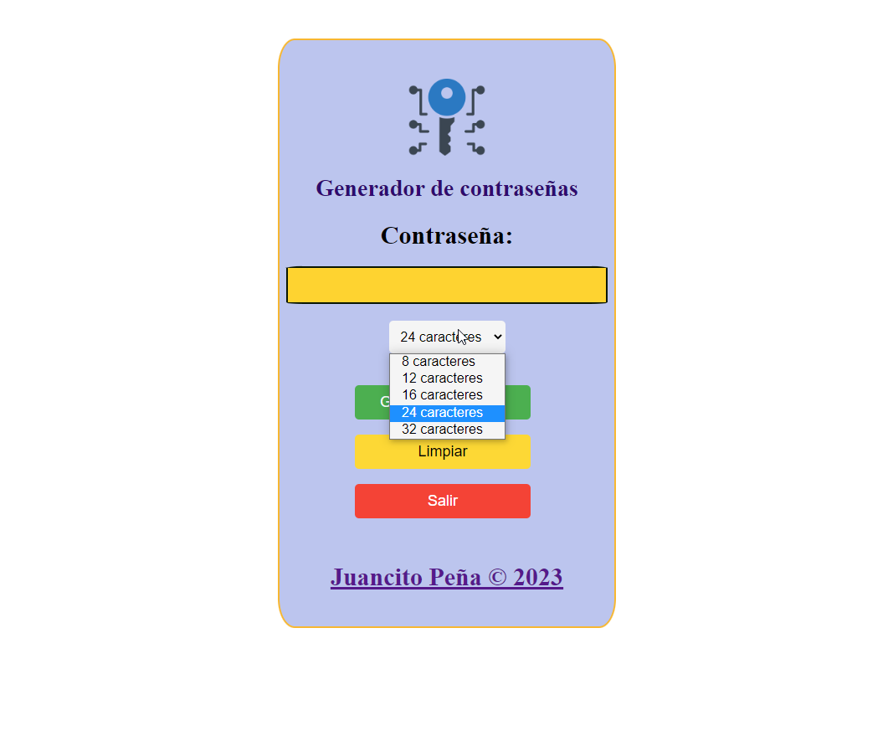

# Generador_de_Password
Generador de contraseñas con HTML, CSS Y JAVASCRIPT

Este repositorio contiene el código fuente de una aplicación de generación de contraseñas encriptadas. La aplicación utiliza HTML, CSS y JavaScript para crear una interfaz de usuario simple con tres botones, una caja de texto y un menú desplegable que permite al usuario elegir la longitud deseada para la contraseña generada. El archivo index.html contiene el código HTML de la interfaz de usuario, mientras que el archivo style.css define su apariencia visual. El archivo script.js contiene el código JavaScript que maneja la generación de contraseñas y su visualización en la caja de texto. ¡Disfrute generando contraseñas seguras y difíciles de descifrar con esta aplicación!

## CAPTURA:

## CAPTURA:

##URL: https://juancitopena.github.io/Generador_de_Password/
